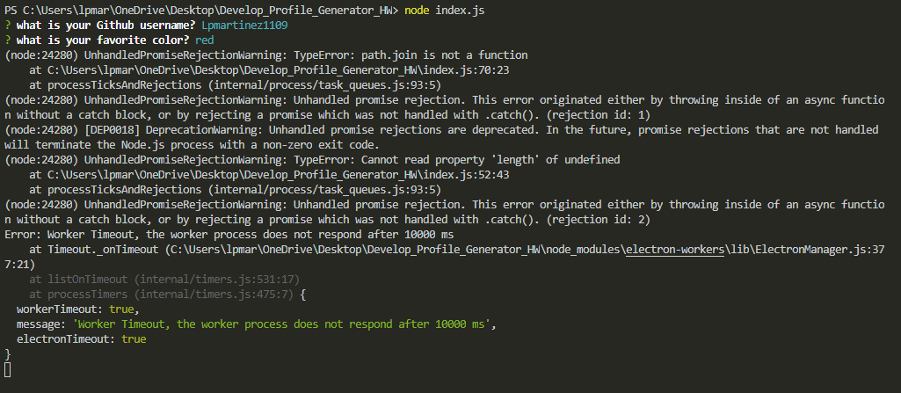
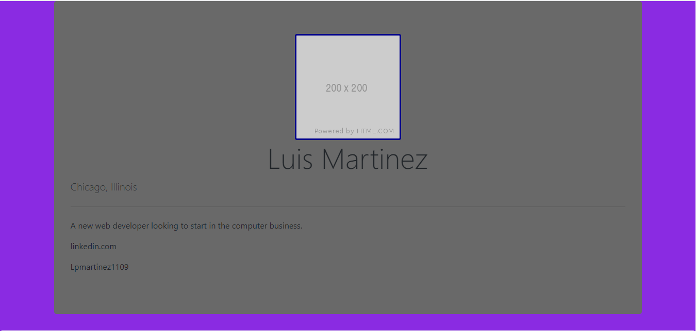
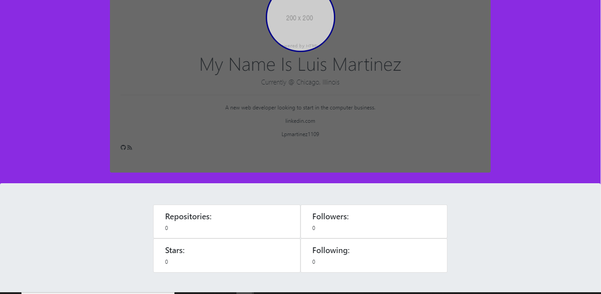

# Develop_Profile_Generator_HW

This is the Developer Profile Generator. The purpose of this assignment is to use information passed through node.js and terminal and through the user of npm packages.  However, users would have install said modules in order for the cod e to fully work. In this ReadME file, there will be a list of the npm files used and the final result so that users can view the end project of the code without having to go through the process on installing everything to test for themselves, unless they want to.

The biggest issue currently is there is a workerTimeout error, with the electron module, and the html is not updating with the informaiton from the api.js

# NPM Used

These are the NPM that were used in this assignment.

# Worker Timeout Error

This is the current error that the assignment encountered.

The other part of the assignment was focusing on creating the html page that would be converted to a pdf file.

# Intial HTML

# Current HTML

This is the current outlook for the html page. The goal is for the information from github and populate the html.